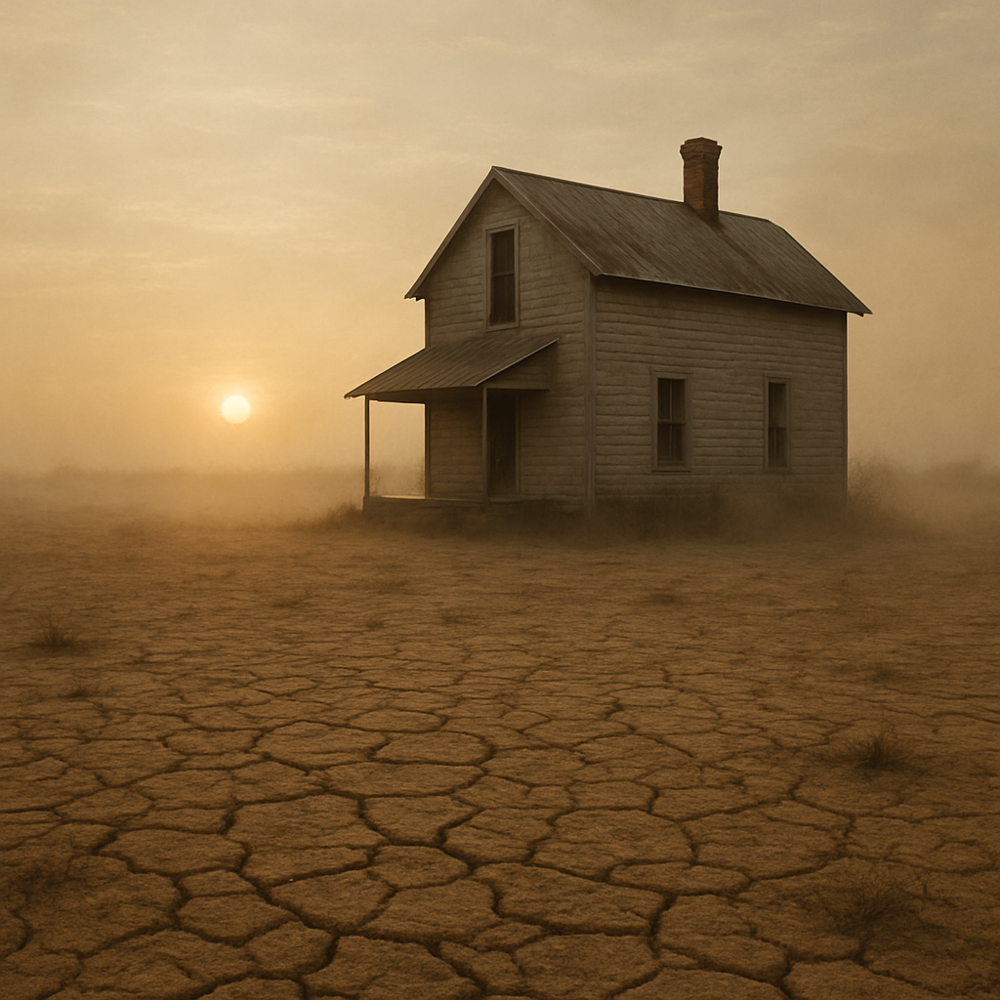
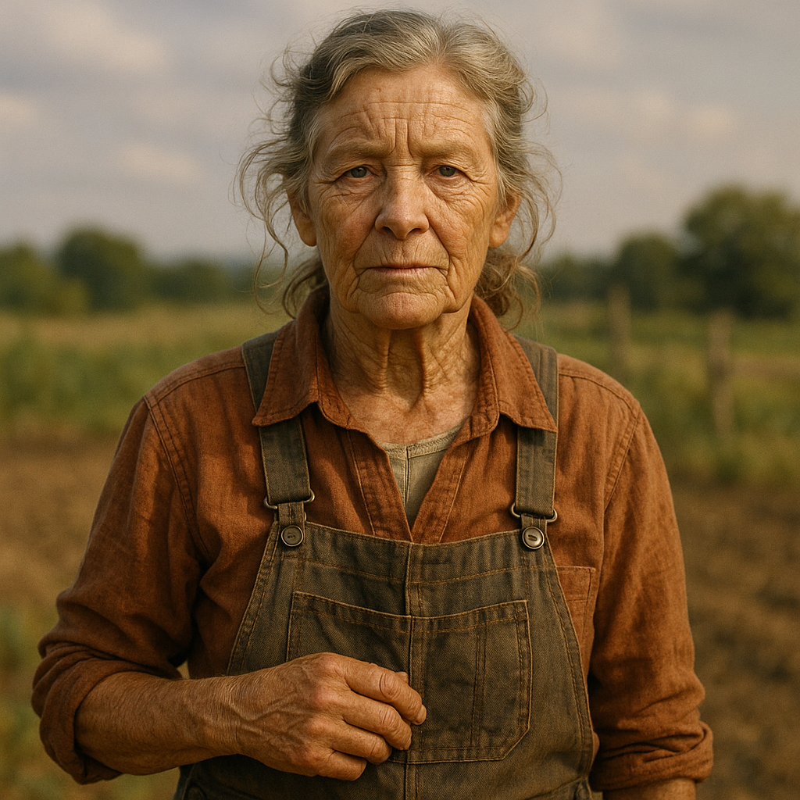

# MovieStudio
AI generated movie video
# README.md

# AI Movie Generator with CrewAI

An open-source automated movie production system that transforms story prompts into complete short films using CrewAI agents. Based on the revolutionary concepts from "Tomorrow's Film Studio Today", this system orchestrates multiple AI agents to handle every aspect of film production - from scriptwriting to visual development, character design, cinematography, and video generation preparation.

## 🎬 Features

- **Automated Screenplay Writing**: Transforms story concepts into professionally formatted scripts
- **Visual Development Pipeline**: Generates concept art, mood boards, and storyboards using DALL-E 3
- **Virtual Actor Creation**: Designs detailed character sheets with multiple angles and expressions
- **Cinematography Planning**: Creates comprehensive shot lists with camera angles and movements
- **Sound Design Architecture**: Develops detailed audio landscapes including dialogue, foley, and music
- **Video Generation Ready**: Produces prompts optimized for Runway Gen-4, Google Veo, and other AI video tools
- **Modular Architecture**: Easy to extend with new agents and capabilities
- **Multiple Style Presets**: Cinematic, documentary, noir, and customizable styles

## 🏗️ System Architecture

The system employs six specialized CrewAI agents working in sequence:

### 1. **Screenplay Writer Agent**
- Transforms story prompts into professional screenplay format
- Handles three-act structure, character development, and dialogue
- Outputs industry-standard formatted scripts

### 2. **Visual Development Artist Agent**
- Creates concept art for key scenes
- Establishes visual style and mood
- Generates color palettes and lighting references

### 3. **Character Designer Agent**
- Designs virtual actors with full character sheets
- Creates multiple angle views and expression guides
- Develops costume and prop details

### 4. **Virtual Cinematographer Agent**
- Plans shot compositions and camera movements
- Creates detailed shot lists with technical specifications
- Designs visual flow and pacing

### 5. **Sound Designer Agent**
- Develops comprehensive sound design documents
- Plans dialogue, foley, ambience, and music
- Creates cue sheets and audio specifications

### 6. **AI Video Director Agent**
- Synthesizes all elements into video generation prompts
- Optimizes for specific AI video platforms
- Maintains consistency across all generated content

## 📋 Prerequisites

- Python 3.8 or higher
- OpenAI API key (for GPT-4 and DALL-E 3)
- FFmpeg (for video processing)
- 8GB+ RAM (16GB recommended)
- 10GB+ free disk space
- Internet connection for API calls

## 🚀 Installation

1. **Clone the repository**:
```bash
git clone https://github.com/yourusername/ai-movie-generator.git
cd ai-movie-generator
```

2. **Create a virtual environment** (recommended):
```bash
python -m venv venv
source venv/bin/activate  # On Windows: venv\Scripts\activate
```

3. **Install dependencies**:
```bash
pip install crewai crewai-tools langchain-openai openai requests pillow
```

4. **Install FFmpeg**:
- **macOS**: `brew install ffmpeg`
- **Ubuntu/Debian**: `sudo apt-get install ffmpeg`
- **Windows**: Download from [ffmpeg.org](https://ffmpeg.org/download.html)

5. **Set up environment variables**:
```bash
export OPENAI_API_KEY="your-openai-api-key-here"
```

Or create a `.env` file:
```
OPENAI_API_KEY=your-openai-api-key-here
```

## 💡 Usage

### Basic Usage

Generate a complete movie production from a simple prompt:

```bash
python main.py "A lonely robot discovers an abandoned flower in a post-apocalyptic city"
```

### Advanced Usage

Customize style, duration, and output:

```bash
python main.py "Your story prompt" --style noir --duration 300 --output my_movie.mp4
```

### Command Line Options

- `prompt` (required): Your story prompt
- `--style`: Visual style preset (default: cinematic)
  - `cinematic`: Professional film look with dramatic lighting
  - `documentary`: Natural, observational style
  - `noir`: High contrast, moody atmosphere
- `--duration`: Target duration in seconds (default: 180)
- `--output`: Output filename (default: my_movie.mp4)

### Example Commands

```bash
# Generate a 5-minute sci-fi film
python main.py "An AI gains consciousness during a solar storm" --duration 300

# Create a noir-style mystery
python main.py "A detective investigates dreams that predict crimes" --style noir

# Short experimental film
python main.py "Colors have sounds in a synesthetic world" --duration 120 --output synesthesia.mp4
```

## 📁 Project Structure

```
ai-movie-generator/
├── movie_generator.py      # Core CrewAI agents and tasks
├── config.py              # Configuration and settings
├── video_assembler.py     # Video assembly and processing tools
├── main.py                # Command-line interface
├── movie_template.md      # Screenplay formatting template
├── requirements.txt       # Python dependencies
├── .env.example          # Environment variable template
├── output/               # Generated content directory
│   ├── scripts/         # Generated screenplays
│   ├── concept_art/     # Visual development artwork
│   ├── storyboards/     # Shot-by-shot storyboards
│   ├── characters/      # Character design sheets
│   ├── production/      # Shot lists and production documents
│   │   └── shot_lists/  # Detailed shot breakdowns
│   ├── sound/          # Sound design documents
│   ├── video_prompts/  # AI video generation prompts
│   └── final/          # Final assembled videos
└── README.md           # This file
```

## 📦 Generated Outputs

### 1. **Screenplay** (`output/scripts/`)
- Professional screenplay format
- Scene headings (INT./EXT.)
- Action lines and dialogue
- Character introductions
- Format: `.fountain` and `.pdf`

### 2. **Concept Art** (`output/concept_art/`)
- High-resolution concept images (1792x1024)
- Key scene visualizations
- Mood and atmosphere references
- Color palette explorations

### 3. **Storyboards** (`output/storyboards/`)
- Shot-by-shot visual planning
- Black and white sketch style
- Camera angle indicators
- Movement and transition notes

### 4. **Character Designs** (`output/characters/`)
- Multi-angle character sheets
- Expression and emotion guides
- Costume and prop details
- Size comparison charts

### 5. **Production Documents** (`output/production/`)
- **shot_list.json**: Complete shot breakdown
- **camera_plan.md**: Cinematography notes
- **schedule.json**: Production timeline
- **tech_specs.md**: Technical requirements

### 6. **Sound Design** (`output/sound/`)
- **sound_design.json**: Complete audio plan
- **dialogue_notes.md**: Voice direction
- **foley_list.csv**: Required sound effects
- **music_brief.md**: Score direction

### 7. **Video Prompts** (`output/video_prompts/`)
- **prompt_[shot_number].json**: Individual shot prompts
- **style_guide.json**: Consistent visual parameters
- **transition_guide.md**: Shot connections
- **vfx_requirements.json**: Special effects needs

## ⚙️ Sample OUTPUT

Creating a movie about the Dust Bowl: "So Shall Ye Reap"

## The Script Emerges

The opening scene went through seven AI iterations before finding its voice:
________________________________________
FADE IN:
EXT. HADLEY FARM - DAWN - 2040
What was once 300 acres of cotton now resembles Mars. Red dust swirls in heat shimmer despite the early hour. A digital thermometer on a fence post reads 97°F at 5:47 AM.

Farm



SARAH HADLEY (73), leather-faced but unbowed, stands in what used to be her garden. She holds a handful of dust, lets it slip through her fingers.

Sarah



SARAH
(to the dust)
Sixty years I fed you. Compost. Manure. Love. This is how you repay me?
A screen door SLAMS. TOM HADLEY (45), farmer's build gone soft from worry, joins her. His AgriTech uniform is three years out of date.

EMMA
Mama, you need to come inside. Air quality's red again.

Emma


SARAH
Air quality's been red since I can last remember.
Tom's smartwatch CHIRPS. He glances at it, his face tightening.


VEO Movie clip "So Shall Ye Reap"

[Watch the video](https://youtu.be/hgVDwgjmh5o)


### Modify Style Presets

Edit `config.py` to add custom styles:

```python
STYLE_PRESETS = {
    "custom_style": {
        "lighting": "your lighting description",
        "color": "your color palette",
        "camera": "your camera style",
        "mood": "your mood description"
    }
}
```

### Adjust Video Settings

```python
VIDEO_SETTINGS = {
    "resolution": "1920x1080",  # or "3840x2160" for 4K
    "fps": 24,                  # or 30, 60
    "aspect_ratio": "16:9",     # or "21:9", "4:3"
    "codec": "h264",
    "bitrate": "10M"
}
```

### Add Shot Types

```python
SHOT_TYPES = {
    "custom_shot": {
        "abbr": "CS",
        "description": "Your shot description"
    }
}
```

## 🔧 Extending the System

### Adding New Agents

Create a new agent in `movie_generator.py`:

```python
new_agent = Agent(
    role='Your Agent Role',
    goal='What this agent accomplishes',
    backstory="Agent's background and expertise",
    verbose=True,
    llm=llm,
    tools=[your_custom_tools],
    allow_delegation=False
)
```

### Creating Custom Tools

Add new tools with the `@tool` decorator:

```python
@tool
def your_custom_tool(parameter: str) -> str:
    """
    Description of what your tool does.
    Used by agents for specific tasks.
    """
    # Your implementation
    result = process_something(parameter)
    return result
```

### Integrating Video Generation APIs

When Runway Gen-4 or similar APIs become available:

```python
@tool
def generate_video_with_runway(prompt: str, duration: int) -> str:
    """Generate video using Runway Gen-4 API"""
    # API implementation
    return video_path
```

## 🎥 Workflow Overview

1. **Story Input** → Script Writer Agent creates screenplay
2. **Script Analysis** → Visual Developer creates concept art
3. **Character Extraction** → Character Designer creates actors
4. **Scene Breakdown** → Cinematographer plans shots
5. **Audio Planning** → Sound Designer creates soundscape
6. **Synthesis** → Video Director creates generation prompts
7. **Assembly** → Video tools compile final movie

## ⚡ Performance Optimization

- **Batch Processing**: Generate multiple images simultaneously
- **Caching**: Reuse generated content across similar projects
- **Resolution Options**: Lower resolution for drafts, high for finals
- **Selective Generation**: Only regenerate changed elements

## 🐛 Troubleshooting

### Common Issues

1. **API Rate Limits**
   - Solution: Add delays between API calls
   - Use exponential backoff for retries

2. **Memory Errors**
   - Solution: Reduce image resolution
   - Process in smaller batches

3. **FFmpeg Not Found**
   - Solution: Ensure FFmpeg is in system PATH
   - Verify installation: `ffmpeg -version`

4. **API Key Errors**
   - Solution: Check API key is correctly set
   - Verify quota hasn't been exceeded

### Debug Mode

Run with verbose output:
```bash
python main.py "Your prompt" --debug
```

## 🤝 Contributing

We welcome contributions! Here's how to help:

### Areas for Improvement

- **Video Generation Integration**: Connect with Runway, Pika, etc.
- **Audio Generation**: Integrate ElevenLabs, Suno
- **Character Animation**: Add movement and expression systems
- **Real-time Preview**: Build preview system during generation
- **Multi-language Support**: Internationalization
- **GUI Interface**: Create user-friendly interface
- **Cloud Deployment**: Dockerize and deploy to cloud

### Contribution Process

1. Fork the repository
2. Create feature branch (`git checkout -b feature/amazing-feature`)
3. Commit changes (`git commit -m 'Add amazing feature'`)
4. Push to branch (`git push origin feature/amazing-feature`)
5. Open Pull Request

### Code Style

- Follow PEP 8
- Add docstrings to all functions
- Include type hints
- Write unit tests for new features

## 📈 Roadmap

- [x] Core agent system
- [x] Script generation
- [x] Visual development
- [x] Character design
- [ ] Runway Gen-4 integration
- [ ] Google Veo integration
- [ ] ElevenLabs voice synthesis
- [ ] Suno music generation
- [ ] Real-time preview system
- [ ] Web interface
- [ ] Cloud deployment

## 📄 License

This project is licensed under the MIT License - see the [LICENSE](LICENSE) file for details.

## 🙏 Acknowledgments

- Built with [CrewAI](https://www.crewai.io/)
- Inspired by "Tomorrow's Film Studio Today" by H. Peter Alesso
- Uses OpenAI's GPT-4 and DALL-E 3
- Community contributors and testers

## 📞 Contact & Support

- **GitHub Issues**: For bug reports and feature requests
- **Discussions**: For general questions and ideas
- **Email**: aimoviegen@example.com
- **Discord**: [Join our community](https://discord.gg/aimoviegen)

## 💰 Costs

Estimated costs per movie (3-5 minutes):
- Script Generation: ~$0.50-$1.00
- Concept Art (10 images): ~$2.00-$3.00
- Storyboards (20-30 panels): ~$4.00-$6.00
- Character Designs (3-5 characters): ~$1.00-$1.50
- **Total**: ~$7.50-$11.50 per short film

Note: Actual video generation costs (Runway, etc.) not included as APIs are not yet publicly available.

## 🚦 Quick Start Guide

1. **Install**: `pip install -r requirements.txt`
2. **Configure**: Set your OpenAI API key
3. **Run**: `python main.py "A robot learns to paint"`
4. **Wait**: 10-20 minutes for full generation
5. **Explore**: Check `output/` directory for results

---

**⚠️ Important Note**: This system currently generates all production documents, scripts, artwork, and prompts needed for AI video generation. Actual video synthesis requires access to AI video generation services (Runway Gen-4, Google Veo, Pika, etc.) which may have separate costs, availability requirements, and API access. The system is designed to seamlessly integrate with these services as they become publicly available.

## CONTACT

Homepage: [Video Software Lab](https://www.videosoftwarelab.com/)

Email: info@ai-hive.net

GitHub: [https://github.com/alessoh/MovieStudio]

For any questions, feedback, or bug reports, please open an issue in the GitHub repository or contact us via email

Acknowl
**Last Updated**: December 2024  
**Version**: 1.0.0